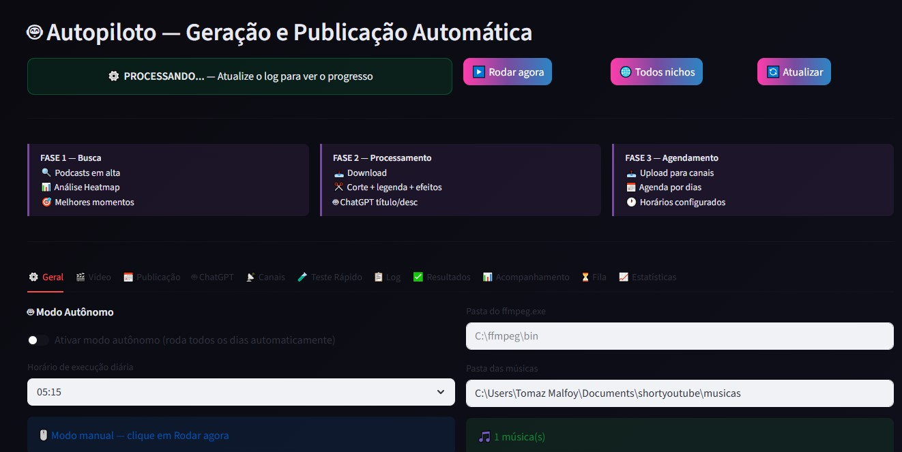

# 🎬 YouTube → Shorts AI

Sistema completo para transformar vídeos do YouTube em Shorts virais automaticamente.  
Complete system to automatically transform YouTube videos into viral Shorts.

---

## ✨ Funcionalidades | Features

- 📥 **Download automático do YouTube**  
  Automatic YouTube video download

- 📊 **Detecção inteligente dos melhores momentos usando heatmap real do YouTube**  
  Smart detection of the most engaging moments using YouTube heatmaps

- ✂️ **Corte preciso com FFmpeg**  
  Accurate video clipping powered by FFmpeg

- 🎨 **Efeitos visuais automáticos**  
  Automatic visual effects (Zoom, Cinematic, Saturation, Vignette...)

- 💬 **Legendas automáticas com Whisper AI**  
  Automatic subtitles using OpenAI Whisper

- 📱 **Formato Shorts/Reels/TikTok (9:16)**  
  Export ready for Shorts, Reels and TikTok

- 🤖 **Modo Autopilot**  
  Autopilot mode for fully automated clipping and publishing

- 📅 **Agendamento automático de uploads**  
  Automatic upload scheduling

- ⬇️ **Download direto pela interface web**  
  Direct download through the web interface

---

## 🤖 Autopilot Mode

> Coloque a imagem `autopilot.jpg` na raiz do projeto para o preview funcionar corretamente no GitHub README.  
> Put the `autopilot.jpg` image in the project root for GitHub preview support.



### O modo Autopilot permite | Autopilot allows:

- 🔍 Encontrar vídeos automaticamente  
  Automatically find videos

- 📈 Detectar melhores momentos com IA  
  Detect high-engagement moments with AI

- ✂️ Cortar e editar automaticamente  
  Automatically clip and edit videos

- 💬 Gerar legendas automáticas  
  Generate subtitles automatically

- 🧠 Criar títulos e descrições com IA  
  Generate titles and descriptions using AI

- 📤 Fazer upload automático para canais  
  Automatically upload to channels

- 🕒 Agendar publicações  
  Schedule posts automatically

---

# 🚀 Instalação | Installation

## 1. Pré-requisitos | Requirements

### FFmpeg

```bash
# Ubuntu/Debian
sudo apt install ffmpeg

# macOS
brew install ffmpeg
```

Windows:  
Download: https://ffmpeg.org/download.html

---

## Python 3.10+

---

## 2. Instalar dependências | Install dependencies

```bash
pip install -r requirements.txt
```

> ⚠️ O Whisper faz download do modelo na primeira execução.  
> Whisper downloads the model on first execution.

Para GPU NVIDIA / For NVIDIA GPU:

```bash
pip install torch torchvision torchaudio
```

---

## 3. Rodar aplicação | Run application

```bash
streamlit run app.py
```

Open:
`http://localhost:8501`

---

# 🗂️ Estrutura do Projeto | Project Structure

```bash
youtube_shorts_maker/
├── app.py
├── autopilot.jpg
├── requirements.txt
├── core/
│   ├── downloader.py
│   ├── analyzer.py
│   └── editor.py
└── output_shorts/
```

---

# ⚙️ Como Funciona | How It Works

## Pipeline

```bash
Original Video
    │
    ▼
[1] Download video
    │
    ▼
[2] Analyze heatmap
    │
    ▼
[3] Detect best moments
    │
    ▼
[4] Clip and crop to 9:16
    │
    ▼
[5] Generate subtitles
    │
    ▼
[6] Apply effects
    │
    ▼
Final Short 🚀
```

---

# 💡 Dicas | Tips

- Use `base` para velocidade  
  Use `base` model for speed

- Use `medium` ou `large-v3` para mais precisão  
  Use `medium` or `large-v3` for better accuracy

- Whisper suporta GPU automaticamente  
  Whisper automatically supports GPU acceleration

---

# 📝 Whisper Models

| Model | Size | Speed | Accuracy |
|---|---|---|---|
| tiny | 75MB | ⚡⚡⚡⚡⚡ | ⭐⭐ |
| base | 142MB | ⚡⚡⚡⚡ | ⭐⭐⭐ |
| small | 466MB | ⚡⚡⚡ | ⭐⭐⭐⭐ |
| medium | 1.5GB | ⚡⚡ | ⭐⭐⭐⭐⭐ |
| large-v3 | 3GB | ⚡ | ⭐⭐⭐⭐⭐ |

---

# ⚠️ Disclaimer

This project is intended for educational and content automation purposes only.

Users are solely responsible for how they use this software, including compliance with:

- YouTube Terms of Service
- Copyright laws
- Platform policies
- Local regulations

The author does not host, distribute, or encourage unauthorized redistribution of copyrighted content.

This tool is designed to automate editing workflows such as clipping, subtitles, formatting, and content enhancement.

By using this software, you agree that all responsibility for downloaded, edited, or published content belongs entirely to the end user.

### The developer assumes no liability for misuse of this software.

---

# ⭐ Apoie o Projeto | Support the Project

Se esse projeto te ajudou / If this project helped you:

- ⭐ Deixe uma estrela no GitHub  
  Leave a star on GitHub

- 🔄 Compartilhe o projeto  
  Share the project

- 💖 Quer apoiar o desenvolvimento?  
  Want to support development?

```bash
PIX: Malfoy.tomaz@gmail.com
```

Toda contribuição ajuda a continuar evoluindo o projeto 🚀  
Every contribution helps improve the project 🚀

## Roadmap

- [x] Video generation
- [x] Subtitle automation
- [x] YouTube upload
- [ ] TikTok upload
- [ ] Kwai upload
- [ ] Web dashboard
- [ ] AWS deployment
